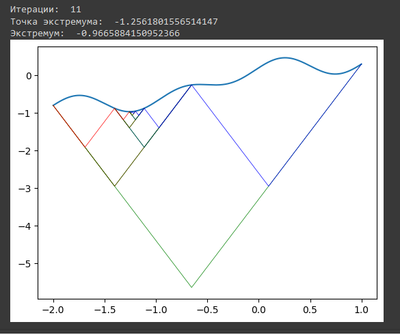

# Цель:
Реализовать метода Пиявского для нахождения глобального экстремума

# Задача:
* Реализовать метод Пиявского на Python
* Сравнить с Excel

# Результат:
Была выбрана функция __f(x) = 0.5*x + 0.2*cos(pi*x) + sin(2*pi*x)__, оптимальные значения
искались в промежутке от -2 до 1.

|                             | Python | Excel  |
|-----------------------------|--------|--------|
| F(x) | -0.997 | -0.964 |
| x                 | -1.256    | -1.283     |

[Google Colab](https://colab.research.google.com/drive/1iDosXkbtOYR-jKVizrLp6WYarH4klNZy?usp=sharing)
