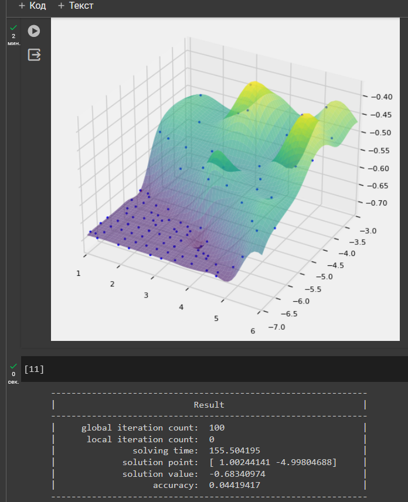

# Цель:
Знакомство с системно-динамическим моделированием

# Задачи:
* Добавить хотя бы один уровень в модель
* Преобразовать модель в код на языке высокого уровня

# Результат:
* Добавлен уровень квалификации продавцов.
* Рассчитано влияние квалификации на спрос.

Пайплайн модели:

Зависимость спроса от квалификации:

# Ссылка на код и демонстрацию работы программы:
[Google Colab](https://colab.research.google.com/drive/13xjjCF8bpb08-8Qq9H2IQb7Nj1O0TNPW?usp=sharing)